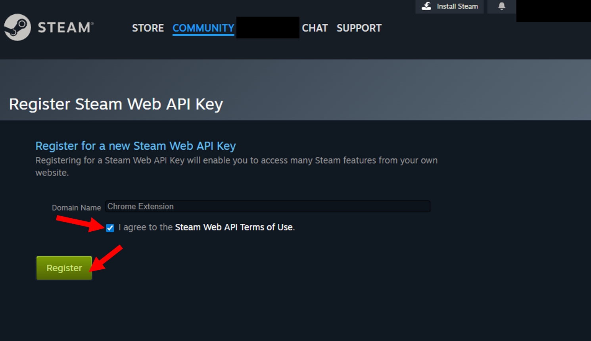
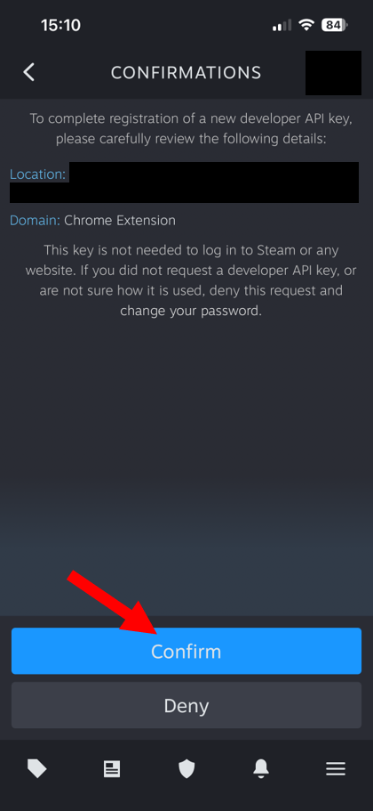
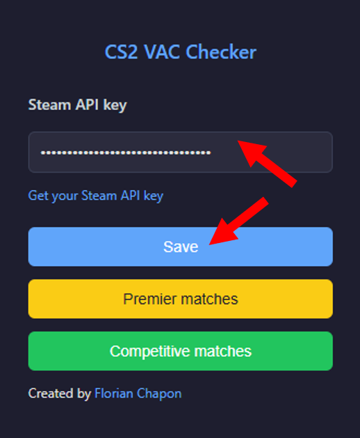
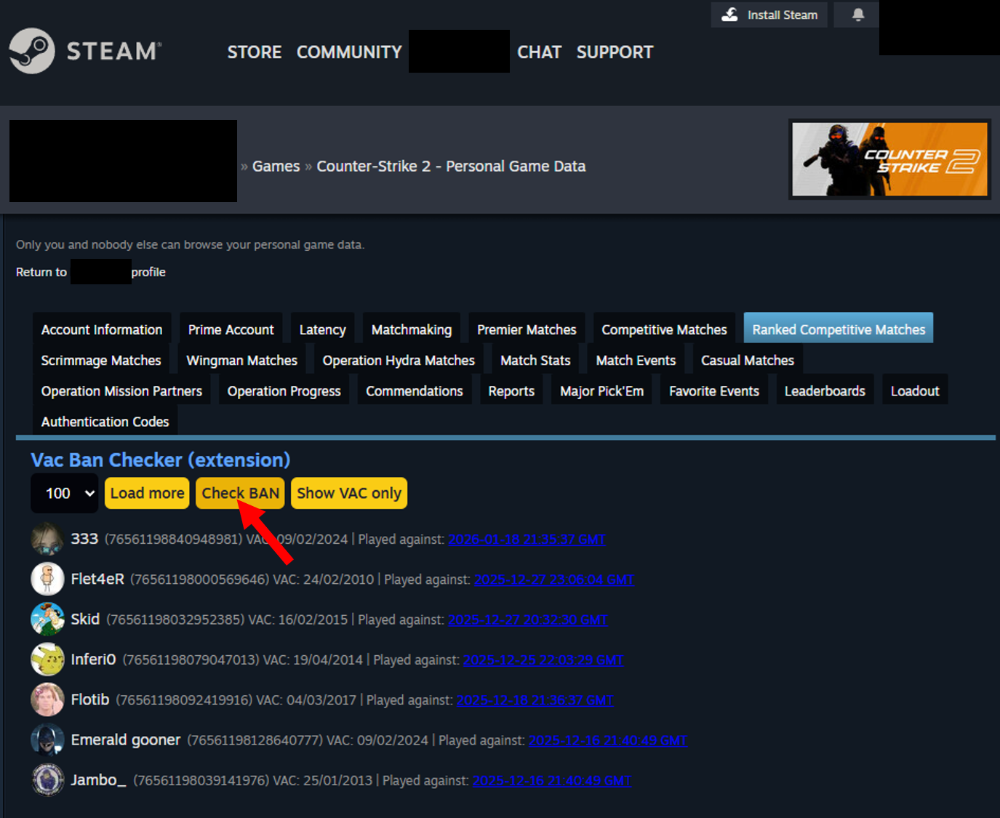
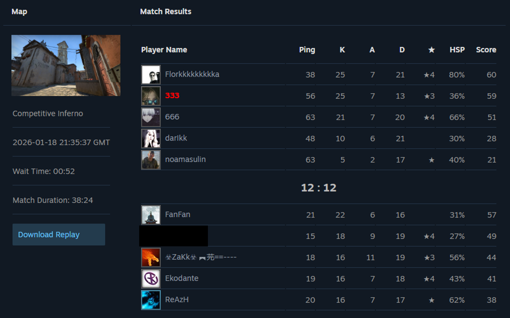

# 🎮 VAC Status Checker – Chrome Extension

A lightweight Google Chrome extension that allows you to **check the VAC (Valve Anti-Cheat) status** of players you’ve previously played with in **Premier** and **Competitive** Counter-Strike 2 matches.

No more wondering *“Was that guy actually cheating?”* — now you can verify it with confidence.

---

## 🚀 Features

- 🔍 Check **VAC ban status** of players from your match history  
- 🎯 Supports **Premier** and **Competitive** game modes  
- ⚡ Fast and lightweight – **only a Steam API key is required**  
- 🧠 Simple UI with clear visual indicators  
- 🔐 Uses official Steam data (no Steam login or credentials required)

---

## 🧩 How It Works

1. The extension extracts **Steam IDs** from your match history pages  
2. It queries the **Steam Web API** for VAC ban information  
3. Results are displayed **directly on the match history webpage**:
   - 🚫 Matches containing VAC-banned players are highlighted  
   - 🔎 Easily identify which matches are affected  

---

## 🔑 Steam API Key Setup (Required)

This extension uses the official Steam Web API. You need to provide your own API key (free).

### 1️⃣ Create or retrieve your Steam API Key

- Go to: https://steamcommunity.com/dev/apikey  
- If you don’t already have an API key:
  - Enter a domain name (e.g. `Chrome Extension`)
  - Accept the terms
  - 
  - Confirm using the Steam Guard mobile app
  - 

### 2️⃣ Configure the API key in the extension

- Copy your Steam API key
-   
- Click on the **VAC Status Checker** extension icon  
- Paste the key into the input field
- Click **Save**
- 

---

## 🕹 How to Use

1. Open the extension popup  
2. Use the shortcuts to access:
   - Premier match history
   - Competitive match history
3. Choose how many previous matches you want to check
4. Click **Load more**
   - 
5. Once the **Check ban** button becomes available, click it
6. VAC-banned accounts will be highlighted directly on the page
   - 
7. Use **“Show VAC only”** to display only matches containing cheaters (highlighted in red)
   - 

Enjoy 🔥

---
